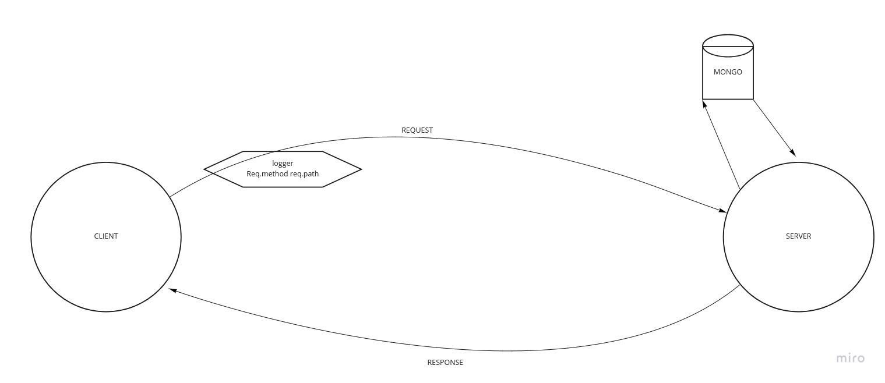

# LAB - Class 04

## Project: api-server

### Author: Matt Ravenmoore

### Links and Resources

- [ci/cd](https://github.com/ravenmoore-401-JS/api-server/actions) (GitHub Actions)
- [back-end server url](https://rm-api-server.herokuapp.com/)

- [submit PR](https://github.com/ravenmoore-401-JS/api-server/pull/3)

### Setup

clone down the project from github
run `npm i`
have mongo installed

#### `.env` requirements (where applicable)

- `PORT` - Port Number
- `MONGOOSE_URI` - mongodb://localhost:27017/<dbname>

#### How to initialize/run your application (where applicable)

run `npm start`

#### How to use your library (where applicable)

#### Tests

- How do you run tests?
to check tests run `npm test`

- Any tests of note?
a few basic status tests for server.
and a few test for methods on dragons.

#### UML

